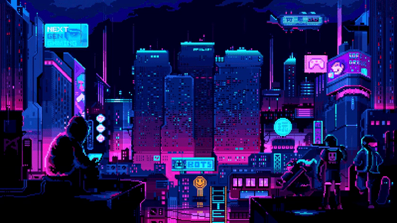

<!-- My Readme Profile!
I spent a lot of time to make my Readme, and if you like it feel free to take inspiration!

**Acknowledgements**
Awesome Readme Templates
Awesome README
How to write a Good readme

**Authors**
@HyunCafe

**Deployment**
Creating a README on GitHub is a simple process. Here are the steps:

Click the "Create new file" button located in a new github repository (your username).

In the "Name your file" field, enter "README.md" (without the quotes).

Feel free to copy and paste anything you liked from my readme (Customizing it to fit your own theme and stats)

Once you've added all the content, scroll to the bottom of the page and click the "Commit new file" button.

Your README will now be visible on the main page of your repository. -->

    

  

<h2 align="center"> Self-taught, curious, and passionate about coding!</h2>

* 🌳 I’m currently learning Vanilla JavaScript!    

* 🐾 I’m looking to network and make friends here!    

* 🌊 2023 Goals: Contribute more to Open Source projects    

* ☕ Interest: Cats, Coffee, and Coding.    

* :octocat: Hobbies: Sleeping, Anime/Manga, Gacha Games, Discord, and Reddit.   

<h2></h2> 

 
   

  <h2> <strong> Actively Learning </strong></h2>
     
  <h2> <strong> Plan to Learn </strong></h2>
  

 
    

  

  <h2> <strong> My Github Stats </strong> </h2>
      
    
    

    
  

  

  

<!-- 

    

 -->

  <h3 align="center">Connect With Me</h3>

   &nbsp;&nbsp;
  
   &nbsp;&nbsp;
  
   &nbsp;&nbsp;

   &nbsp;&nbsp;
  <a>
    
    HyunSun#7206

 
